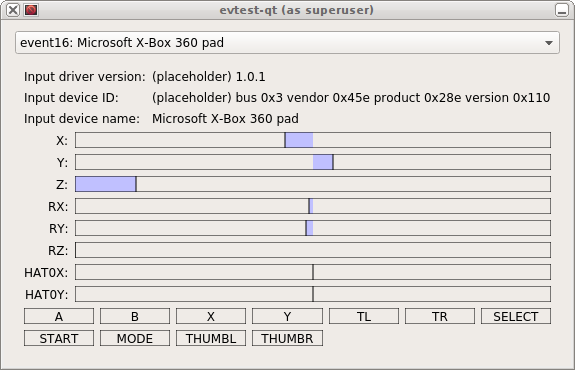

evtest-qt
=========

`evtest-qt` is a simple input device tester for Linux, it is analogous
to the `evtest` command line tool, but with a Qt based GUI. It
provides a list of attached input devices and displays which axis and
buttons are pressed.

The latest version can be found at:

 * http://github.com/Grumbel/evtest-qt/

Compiling
---------

`evtest-qt` uses CMake:

    mkdir build
    cd build
    cmake ..
    make

For extra warnings run:

    cmake .. -DWARNINGS=ON

Usage
-----

Since regular users generally don't have direct access to input
devices, running as root is often needed:

    sudo build/evtest-qt

An event device can also be selected directly from command line:

    sudo build/evtest-qt /dev/input/event1

Screenshots
-----------

